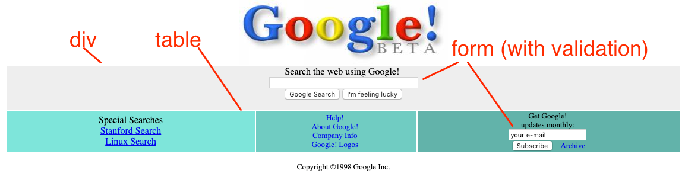

# Days 5 - 8 HTML & HTML 5

Now you have seen the videos from this chapter, you're ready to start experimenting with HTML & HTML 5. But don't sweat the web design yet. We'll stay focused on the 90's for our sites so we get the native unstyled feel working for us.

## Day 1: Watch the video lessons

The watch the videos and keep track of where you might want to grab some examples. Remember you have everything you saw typed in the demos folder adjacent to this one if you need them.

## Days 2-3: Recreate Google's homepage

For your hands-on exercises during this chapter, you'll do something quick and easy: recreate Google! 

While I made fun of Yahoo! for being nothing but a glamorized Yellow Pages, the tech behind Google was truly revolutionary at the time.

But their web design was decidedly not special. Check it out in the way back machine (choose 1998 for your time frame):

[http://web.archive.org/web/19981202230410/http://www.google.com/](http://web.archive.org/web/19981202230410/http://www.google.com/)

Here's the design with a few visual notes on what is required for each part of the page (yes, tables make a comeback). No really, view the source, it's tables and the center tag even!



Your job is to recreate this home page. Feel free to save the Google logo from the way back machine for your page (right-click, save image as...). Then recreate the home page with forms and validation per the graphic above.

If you are unfamiliar with HTML tables, here's a primer:

```
<table border="0" width="90%">
	<tr>
		<td bgcolor="#EEEEEE">
			column details here...
		</td>
		<td bgcolor="#EEEEEE">
			column details here...
		</td>
		<td bgcolor="#EEEEEE">
			column details here...
		</td>
	</tr>
</table>
```


## Day 4: Add a login form

Imagine Google more like it is today, with services that require a dedicated account. 

Extend your basic Google homepage to have a register page (link to a second HTML file). Use what you learned about input validation and HTML forms to build the nicest registration form you can without worrying about design just yet.

### Time to share what you've accomplished!

Be sure to share your last couple of days work on Twitter or Facebook. Use the hashtag **#100DaysOfWeb**. 

Here are [some examples](https://twitter.com/search?q=%23100DaysOfCode) to inspire you. Consider including [@talkpython](https://twitter.com/talkpython) and [@pybites](https://twitter.com/pybites) in your tweets.

*See a mistake in these instructions? Please [submit a new issue](https://github.com/talkpython/100daysofweb-with-python-course/issues) or fix it and [submit a PR](https://github.com/talkpython/100daysofweb-with-python-course/pulls).*


