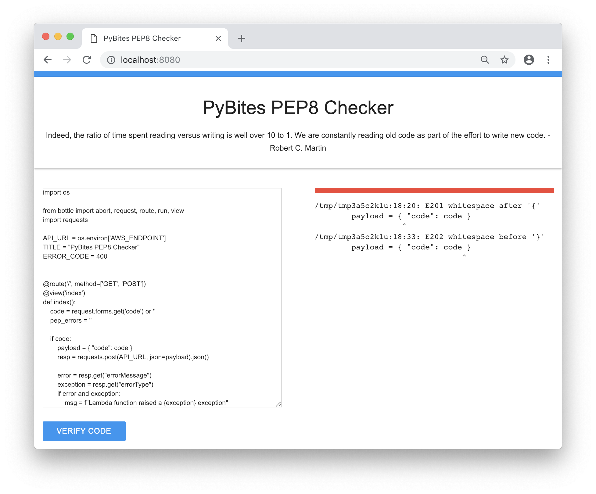
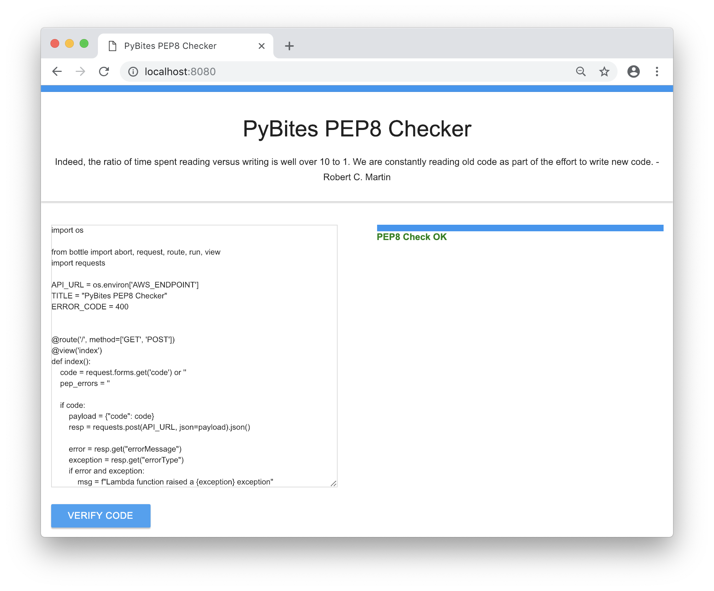
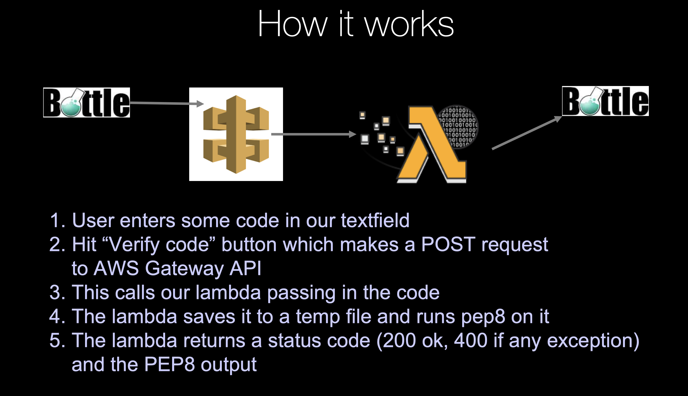

# Days 85-88 AWS Lambda

[AWS Lambda](https://aws.amazon.com/lambda/) is a really cool [_serverless_](https://en.wikipedia.org/wiki/Serverless_computing) technology that lets you _run code without thinking about servers_, paying only for the compute time you consume! Check out the [AWS Lambda site](https://aws.amazon.com/lambda/) for more details.

In the coming 4 days we're going to create a [Bottle web app](https://bottlepy.org/docs/dev/) front-end that lets users check if their code is PEP8 compliant.

The actual PEP checking will happen on AWS by means of a [lambda function](https://aws.amazon.com/lambda/) we are going to write. Here is how the app will look when non-compliant code is checked:

And this is the architecture behind it:

---

So here is the plan for the coming 4 days:

## Day 1. + 2. - Watch the videos 

The first two days you will watch me code up a simple web app from scratch using Bottle.

As the PEP8 checker lambda requires external dependencies (increased complexity), I will first show you a more basic lambda: a simple calculator. As a bonus you will learn about the [operator module](https://docs.python.org/3/library/operator.html) :)

We will see how we can integrate our lambda with [Amazon API Gateway](https://aws.amazon.com/api-gateway/): a POST request from our app will trigger the lambda and return a response our app will consume.

You will also learn how to quickly test your lambda from the AWS Lambda GUI using _test events_.

After having all the pieces in place we can tackle a more complex lambda: the _PEP checker_. We will use the [pycodestyle](https://pypi.org/project/pycodestyle/) (formerly called _pep8_) package. You will learn how to upload a lambda that requires external packages. This is actually a huge deal! You can [shop around](https://pypi.org/) and deploy all kind of cool packages to your future lambdas, the world is your oyster!

I hope this more gradual approach makes it easier for you to follow along, because there is quite some stuff to learn in this chapter!

## Day 3. + 4. - Practice yourself

You probably guessed it, starting day 3 you will code up your own lambda! Truth be told: AWS requires a credit card upon creating an account, so you need to decide for yourself if you want to follow making your own account. I do recommend it though given the usefulness of their technology (we use it for [our platform](https://codechalleng.es)!) and they have a very generous free tier: 1 million free requests per month!

Regardless we have a PyBites Code Challenge where you can PR your code for review and to share it with our community (if you don't make an account maybe somebody else wants to deploy it for you?)

Head over to [PCC36 - Create an AWS Lambda Function](https://codechalleng.es/challenges/36) and check out the challenge instructions. You can code locally, but to submit your work to our _Community_ branch, I recommend you follow the _Git Setup_ instructions there.

Special shout out to [Michael Herman](https://testdriven.io/) who delivered this challenge on our blog some time ago.

Have fun and share your work with us, we are very curious what lambda functions you will write! Good luck and remember: _the learning is in the practice_!

### Time to share what you've accomplished!

Be sure to share your last couple of days work on Twitter or Facebook. Use the hashtag **#100DaysOfWeb**.

Here are [some examples](https://twitter.com/search?q=%23100DaysOfCode) to inspire you. Consider including [@talkpython](https://twitter.com/talkpython) and [@pybites](https://twitter.com/pybites) in your tweets.

*See a mistake in these instructions? Please [submit a new issue](https://github.com/talkpython/100daysofweb-with-python-course/issues) or fix it and [submit a PR](https://github.com/talkpython/100daysofweb-with-python-course/pulls).*
